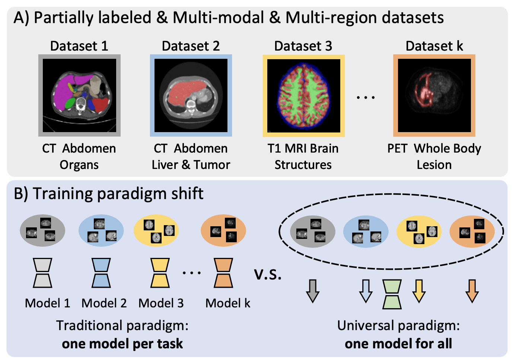

# Universal Medical Image Segmentation [](https://arxiv.org/pdf/2306.02416.pdf) [](https://yunhegao.tech/Hermes-page/)

<div align="center">
    <a></a>
    <a></a>

</div>


This repository if the official implementation for the paper:
> **[Training Like a Medical Resident: Universal Medical Image Segmentation via Context Prior Learning](https://arxiv.org/abs/2306.02416)** \
> Yunhe Gao<sup>1</sup>, Zhuowei Li<sup>1</sup>, Di Liu <sup>1</sup>, Mu Zhou<sup>1</sup>, Shaoting Zhang<sup>2</sup>, Dimitris N. Metaxas <sup>1</sup> \
> <sup>1</sup> Rutgers University   <sup>2</sup> Shanghai Artificial Intelligence Laboratory



## Abstract

A major enduring focus of clinical workflows is disease analytics and diagnosis, leading to medical imaging datasets where the modalities and annotations are strongly tied to specific clinical objectives. To date, building task-specific segmentation models is intuitive yet a restrictive approach, lacking insights gained from widespread imaging cohorts. Inspired by the training of medical residents, we explore universal medical image segmentation, whose goal is to learn from diverse medical imaging sources covering a range of clinical targets, body regions, and image modalities. Following this paradigm, we propose Hermes, a context prior learning approach that addresses the challenges related to the heterogeneity on data, modality, and annotations in the proposed universal paradigm. In a collection of seven diverse datasets, we demonstrate the appealing merits of the universal paradigm over the traditional task-specific training paradigm. By leveraging the synergy among various tasks, Hermes shows superior performance and model scalability. Our in-depth investigation on two additional datasets reveals Hermes' strong capabilities for transfer learning, incremental learning, and generalization to different downstream tasks.


## Updates
* 06/04/2023: [Hermes](https://arxiv.org/abs/2306.02416) paper uploaded to arXiv


## To Do
* Release data preparation script.
* Release training code.
* Release model weights.

## Citation

If you use Hermes in your research, please cite our paper:

```bibtex
@article{gao2023training,
  title={Training Like a Medical Resident: Universal Medical Image Segmentation via Context Prior Learning},
  author={Gao, Yunhe and Li, Zhuowei and Liu, Di and Zhou, Mu and Zhang, Shaoting and Meta, Dimitris N},
  journal={arXiv preprint arXiv:2306.02416},
  year={2023}
}
```

## Contact

For questions and suggestions, please post a GitHub issue or contact us directly via email (yunhe.gao@rutgers.edu).

